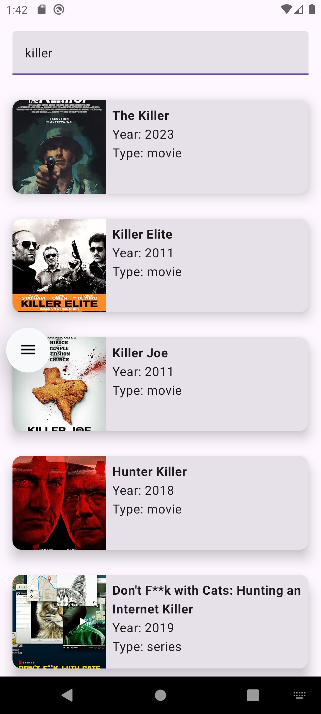
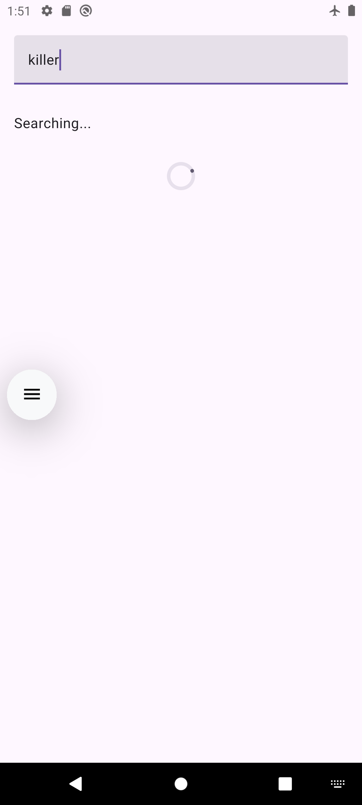
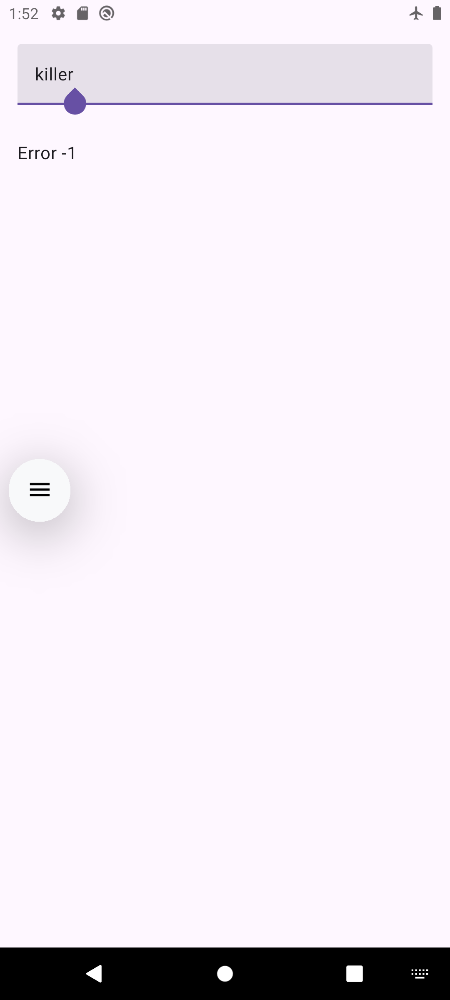

# 🎬 IMDB Movie Search App

An **Android IMDB Movie Search App** that allows users to **search movies, view details, and explore posters** using the [OMDb API](https://www.omdbapi.com/). Built with **MVVM architecture, Jetpack Compose, Hilt, and Retrofit**.

## 📸 Screenshots & Demo

| Search Result | Searching inprogress | Error state |
|------------|---------------|--------------|
|  |  |  |

🎥 **Video Demo:**  
[] (https://youtube.com/shorts/qcu4OUrIO48)

---

## 🚀 Features
✅ **Search Movies** by title  
✅ **View Movie Details** (Title, Year, Poster)  
✅ **Jetpack Compose UI**
✅ **MVVM + Hilt** architecture  
✅ **Error Handling

---

## 🏗 Tech Stack
- **Language**: Kotlin 
- **UI**: Jetpack Compose 
- **Architecture**: MVVM 
- **Dependency Injection**: Hilt 
- **Networking**: Retrofit + OkHttp 
- **Image Loading**: Coil 

---

## 📥 Installation
### **1. Clone the repository**
Make sure to add apikey file named as 'api.properties' in root directory 
with valid key in following fomate 
IMDB_APIKEY="<YOUR_APIKEY>"
```bash
git clone [https://github.com/nirocknrk/ImdbMovieSeach-Android.git]
cd MovieFinder
